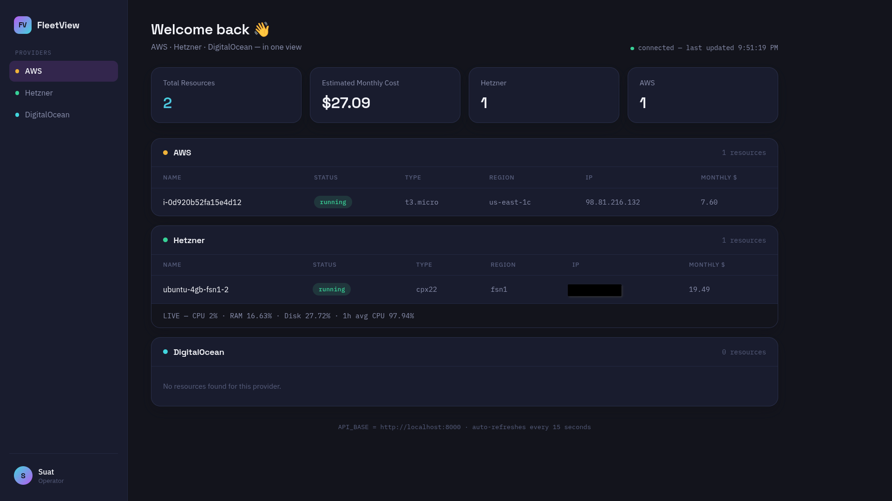

# FleetView

[](https://github.com/suatdurkaya/fleetview/actions/workflows/ci.yml)
[](LICENSE)
[](https://www.python.org/downloads/)
[](https://fastapi.tiangolo.com/)

A multi-cloud resource dashboard that pulls live server data from AWS, Hetzner,
and DigitalOcean into a single, authenticated view — with real-time CPU/RAM/disk
metrics powered by Prometheus.



## Why this exists

Managing infrastructure across multiple providers means switching between
different consoles, each with its own UI, pricing model, and data format.
FleetView solves this by normalizing resources from all three providers into
a single schema and surfacing them (plus live system metrics) in one
dashboard.

## Features

- **Multi-cloud resource aggregation** — fetches EC2 instances (AWS), servers
  (Hetzner), and droplets (DigitalOcean) concurrently using `asyncio.gather`,
  then normalizes them into a common `CloudResource` model
- **JWT authentication** — bcrypt-hashed password, signed/expiring tokens,
  no credentials ever exposed client-side
- **Live infrastructure metrics** — CPU, RAM, and disk usage pulled from
  Prometheus (via `node_exporter` running on the monitored server)
- **Single-page dashboard** — dark, ops-console-style UI with auto-refresh
  every 15 seconds
- **CI pipeline** — GitHub Actions verifies the app imports cleanly on every
  push
- **Containerized** — runs anywhere with `docker-compose up`

## Architecture

```
┌─────────────┐     async/parallel      ┌──────────────┐
│   FastAPI    │ ───────────────────────▶│  AWS EC2 API │
│   Backend    │                          └──────────────┘
│              │ ───────────────────────▶┌──────────────┐
│  (JWT auth)  │                          │ Hetzner API  │
│              │                          └──────────────┘
│              │ ───────────────────────▶┌──────────────┐
│              │                          │DigitalOcean  │
│              │                          │     API      │
└──────┬───────┘                          └──────────────┘
       │
       │ PromQL queries
       ▼
┌──────────────┐      scrapes      ┌──────────────┐
│  Prometheus  │ ◀─────────────────│ node_exporter │
└──────────────┘                    └──────────────┘
       ▲
       │ served to
┌──────┴───────┐
│  Dashboard   │
│ (index.html) │
└──────────────┘
```

## Tech stack

Python · FastAPI · asyncio/httpx · Pydantic · JWT (PyJWT) · bcrypt (passlib) ·
Prometheus · node_exporter · Docker · Docker Compose · GitHub Actions

## Getting started

### Prerequisites

- Docker and Docker Compose
- API tokens for the providers you want to monitor (read-only scope is
  sufficient — see below)
- A Prometheus instance reachable from the backend, with `node_exporter`
  running on the server(s) you want metrics for

### 1. Clone and configure

```bash
git clone https://github.com/suatdurkaya/fleetview.git
cd fleetview
cp .env.example .env
```

Fill in `.env`:

```
HETZNER_API_TOKEN=
DIGITALOCEAN_API_TOKEN=
AWS_ACCESS_KEY_ID=
AWS_SECRET_ACCESS_KEY=
AWS_REGION=eu-central-1

ADMIN_USERNAME=
ADMIN_PASSWORD_HASH=
JWT_SECRET_KEY=
JWT_ALGORITHM=HS256

PROMETHEUS_URL=http://localhost:9090
```

Generate a password hash:
```bash
python3 -c "from passlib.context import CryptContext; print(CryptContext(schemes=['bcrypt']).hash('your-password'))"
```

Generate a JWT secret:
```bash
python3 -c "import secrets; print(secrets.token_hex(32))"
```

**Never commit `.env`.** Use read-only API scopes wherever the provider
offers them — this app only reads infrastructure state, it never modifies it.

### 2. Run

```bash
docker-compose up --build
```

Open `http://localhost:8000/static/index.html`, log in with the password you
hashed above.

## API reference

All endpoints except `/api/login` require `Authorization: Bearer <token>`.

| Endpoint | Method | Description |
|---|---|---|
| `/api/login` | POST | Exchange password for a JWT access token |
| `/api/resources` | GET | All resources across providers, normalized |
| `/api/metrics` | GET | CPU/RAM/disk usage from Prometheus |

Full interactive docs at `/docs` (Swagger UI, auto-generated by FastAPI).

## Setting up Prometheus + node_exporter on a monitored server

This app expects a Prometheus instance to already be scraping your servers.
On each server you want metrics for:

1. Install and run `node_exporter` as a systemd service (exposes metrics on
   `:9100`)
2. Point your Prometheus `scrape_configs` at that server's `:9100`
3. Point `PROMETHEUS_URL` in `.env` at your Prometheus instance

Both `node_exporter` and `prometheus` should run as dedicated, unprivileged
system users (least-privilege principle) — not `root`.

## Roadmap

- [ ] "Idle resource" detection — flag servers with sustained low CPU usage
- [ ] Multi-server metrics (currently scoped to a single Prometheus target)
- [ ] Terraform module to provision the monitoring stack itself
- [ ] Kubernetes deployment manifests

## Security notes

- API tokens are requested with read-only scope; this app never issues
  start/stop/restart commands against real infrastructure
- Passwords are bcrypt-hashed, never stored or logged in plaintext
- JWTs expire after 12 hours
- `.env` is git-ignored and docker-ignored; secrets are injected at runtime,
  never baked into the Docker image